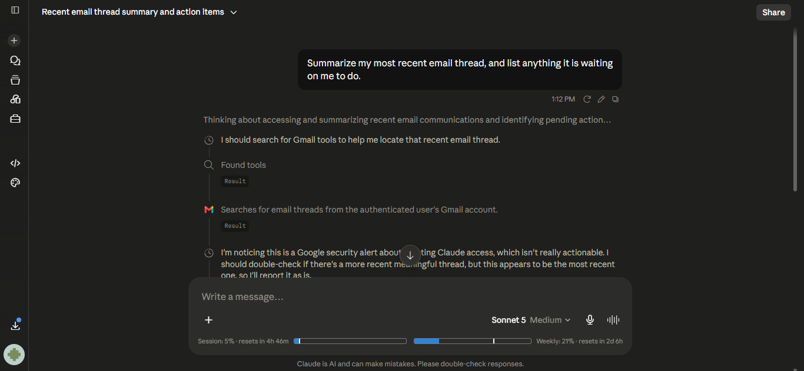
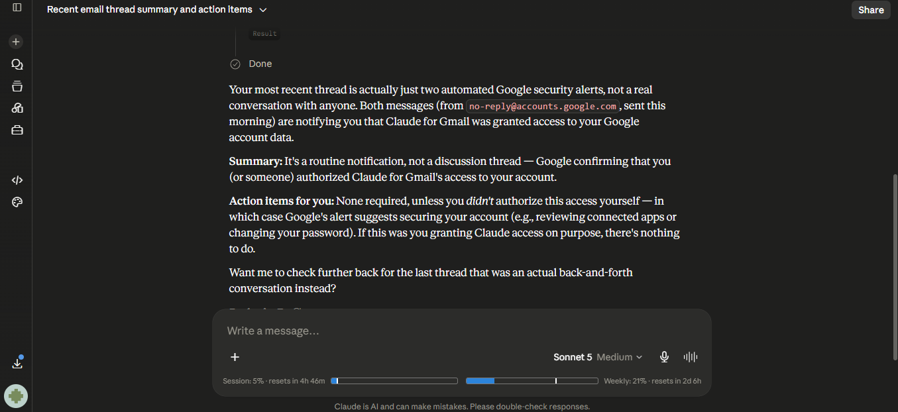
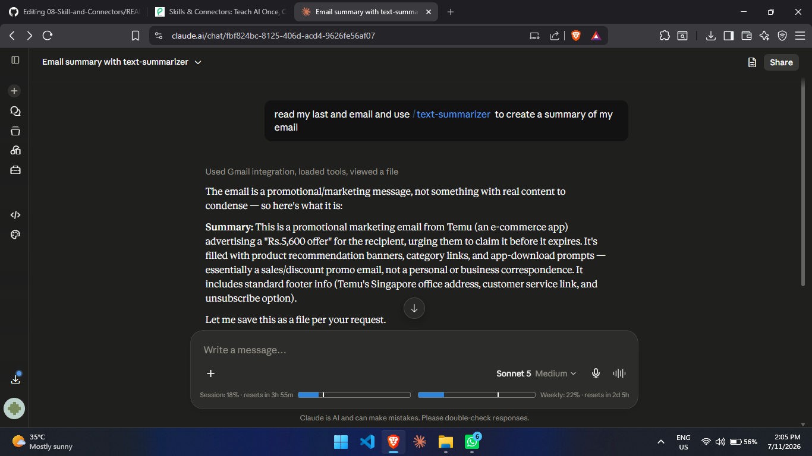
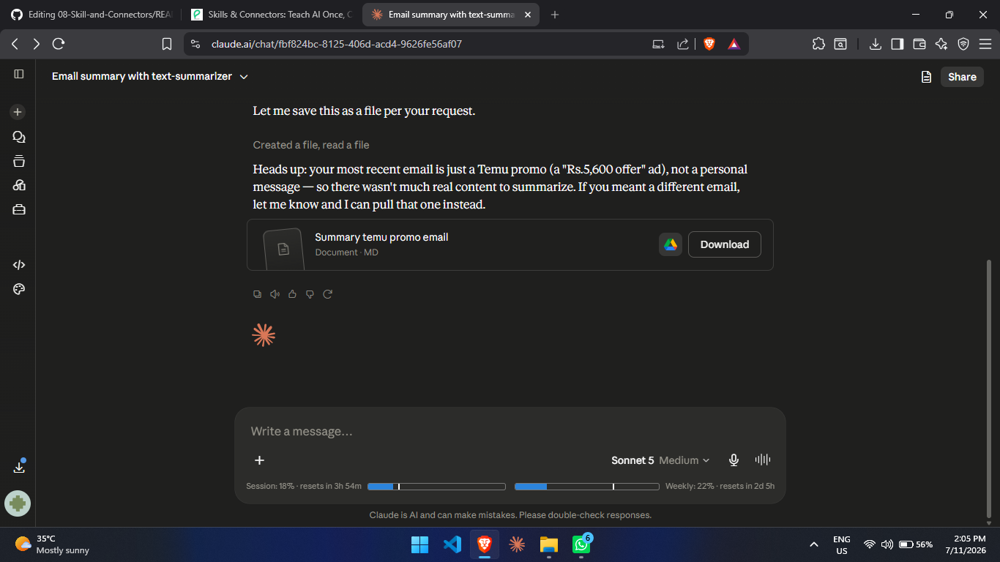

# 08-Connectors and Skills
### Tools/App Used: Claude
## *Task 1 — Build Your First Real Skill (Your Own Daily-Life Skill)*
### Skill: summary-generator
### Prompt:
```
create a skill, named "Summary Generator" which triggers when claude reach its 90% chat token limit,
the purpose of the skill should to create an summary of the chat which i can paste directlly into
other chat models to continue my work from where my tokens got limited
```

### Name
summary-generator
 
### What it does
- Watches the conversation for signs it's getting long or hard to continue: Anthropic's own long-conversation signal, a high turn count, a lot of generated content, or the user saying something like "this is getting long."
- The moment it notices one of those signs — or if the user just asks directly — it writes up everything that matters: the goal, key facts and constraints, decisions already settled, what's been built so far, and what's left to do.
- Saves that write-up as a downloadable `.md` file and hands it over as part of its normal reply, with one short line explaining why the file showed up.
- Doesn't ask permission first, and doesn't repeat itself every turn — only produces a new file after real new progress or a fresh request.
- The point: paste the resulting file into a new chat — with Claude or a different AI model — and pick up exactly where things left off, without re-explaining everything or losing decisions that took real back-and-forth to reach.
### Description
Automatically creates a downloadable Markdown handoff summary of the conversation so the user can paste it into a new chat or different AI model and continue without losing progress. There's no way to read an exact token percentage, so trigger this proactively and WITHOUT asking permission when: a long_conversation_reminder appears, the conversation has clearly grown very long or heavy (dozens of turns, several large artifacts, an extended multi-step task), or the user hints they're worried about losing the chat or running low on room. Also trigger on direct requests like "summarize this chat", "give me a handoff/recap", "I need to continue this in ChatGPT/Gemini/a new chat", "export this conversation", or "save my progress". Generate and deliver the file as part of the normal reply -- don't ask first -- and briefly explain why. Don't regenerate every turn; only make a new one after substantial new work or a fresh explicit request.

### Result:

[MD File Generated By Using Skill](Task-1/handoff-summary-ai-agent-factory-review.md) (Click to View)

## *Task 2 — Connect One App, Read-Only*

### Prompt:
```
Summarize my most recent email thread, and list anything it is waiting
on me to do.
```
### Response:




## *Task 3 — Wire a Skill and Connector together*
#### Created a seprate sill fro this task and Used Gmail Connector
### Prompt:
```
read my last and email and use /text-summarizer  to create a summary of my email

```
### Response:




